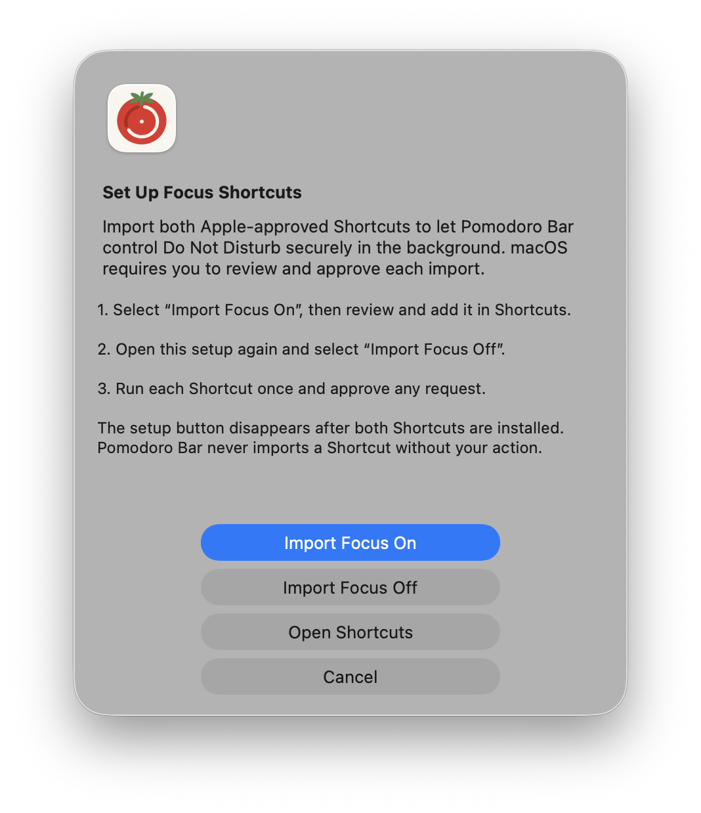

# JAMF Pro deployment guide

## Recommended package deployment

1. Build, sign, and test the installer package.
2. Upload the package to the JAMF Pro distribution point.
3. Create a Computer Policy scoped to the required Macs.
4. Add the package with action **Install**.
5. Optionally add `configure-managed-defaults.sh` as a script with duration parameters.
6. Configure notification permissions for bundle ID `com.company.pomodorobar` if your organization manages them.
7. Run the policy once per computer or expose it in Self Service.

The package installs:

- `/Applications/Pomodoro Bar.app`
- `/Library/LaunchAgents/com.company.pomodorobar.plist`

The LaunchAgent starts the app for users at login. The package post-install script bootstraps it immediately when a GUI user is already signed in. If the package is installed at the login window, launchd starts the app after the next successful user login.

The package includes signed **Pomodoro Focus On** and **Pomodoro Focus Off** files. Apple requires each user to review and approve shared Shortcut imports, so the installer does not attempt to add them silently or as root. Users can complete both imports from **Set Up Focus** in the app.

Provide users with the [illustrated Focus Shortcut setup guide](SHORTCUTS.md). Each user must import **Focus On**, import **Focus Off**, and run both once. No Accessibility PPPC payload is needed for this workflow because Pomodoro Bar invokes the approved Shortcuts in the background without controlling the macOS interface.

JAMF administrators should not attempt to automate the **Add Shortcut** button. macOS intentionally requires approval in the user's Shortcuts library, and the supported `shortcuts` command-line tool does not offer an import operation.

## HTTPS script deployment

Use `jamf-deploy.sh` only when the package is hosted at a stable HTTPS URL. Configure these JAMF script parameters:

| Parameter | Value |
| --- | --- |
| 4 | Required HTTPS URL for the signed package |
| 5 | Expected Apple Developer Team ID; strongly recommended |

Avoid placing credentials in the URL or script. Use a time-limited signed URL or a JAMF package distribution point.

## Managed durations

`configure-managed-defaults.sh` accepts:

| Parameter | Default | Purpose |
| --- | ---: | --- |
| 4 | 25 | Focus duration in minutes |
| 5 | 5 | Short-break duration in minutes |
| 6 | 15 | Long-break duration in minutes |

Run configuration before launching the app. Existing timers adopt new values on their next phase or after relaunch.

## Uninstall policy

Add `jamf-uninstall.sh` to a separate Computer Policy and run it with root privileges.

| Parameter 4 | Result |
| --- | --- |
| `false` or empty | Remove the app, LaunchAgent, and package receipt; retain user history and settings |
| `true` | Also delete `com.company.pomodorobar.plist` for local users with UID 500 or higher |

Keeping preferences is useful for temporary removal or upgrades. Use `true` for a complete removal requested by the user or during device decommissioning.

## Smart Group checks

Useful inventory conditions include application title `Pomodoro Bar.app`, application version `1.0.0`, or package receipt `com.company.pomodorobar.pkg`. After an uninstall policy, request an inventory update if policy scoping depends on current application inventory.

## Rollback

Deploy the previously approved package version using a JAMF policy. The app stores only backward-compatible primitive preferences. For a clean rollback, run the uninstaller with parameter 4 set to `true`, then deploy the earlier version.
