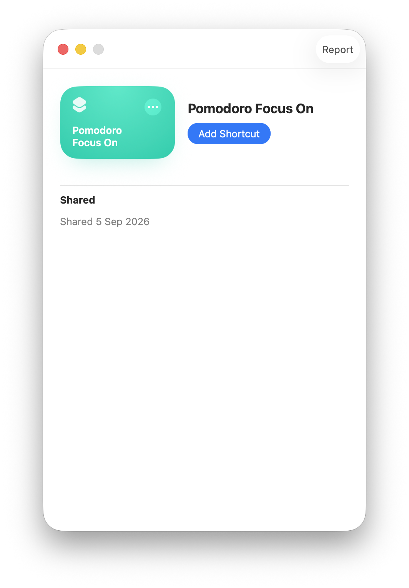

# Focus Shortcut setup

Pomodoro Bar controls macOS Focus without opening Control Center or simulating keyboard and mouse input. The app runs two Apple Shortcuts in the signed-in user's background session:

- **Pomodoro Focus On** enables the user's configured Focus when a focus timer starts.
- **Pomodoro Focus Off** disables Focus when a focus timer stops or a break begins, allowing normal notifications to return.

## What users see

If either required Shortcut is missing, **Set Up Focus** appears in the Pomodoro Bar panel. Selecting it opens this guide:


The user completes the setup in this order:

1. Select **Import Focus On**.
2. Review the Shortcut in Apple's Shortcuts app and select **Add Shortcut**.
3. Open **Set Up Focus** again and select **Import Focus Off**.
4. Review and add the second Shortcut.
5. Run each Shortcut once and approve any macOS request.

Apple's review screen looks like this:



The **Set Up Focus** button disappears automatically after both Shortcut names are detected. **Open Shortcuts** remains available in the setup guide for troubleshooting.

## Why installation requires user approval

The application bundle contains signed copies of both Shortcut files, but macOS does not provide a supported command for silently importing a shared Shortcut. Shortcut collections also belong to individual users, while a JAMF package normally installs as `root`.

For those reasons, the package deploys the files but never imports them automatically. Each user must review and approve both imports in Apple's Shortcuts app. This preserves the macOS trust prompt and avoids unsupported UI scripting.

## Background operation

After setup, Pomodoro Bar invokes the shortcuts with the macOS `shortcuts` command-line tool. The operation is background-only:

- No Control Center window is opened.
- No mouse or keyboard actions are generated.
- Accessibility permission is not required for Focus control.
- The Shortcut runs as the currently signed-in user, not as `root`.

The app serializes Focus commands so rapid Start, Pause, Reset, or Skip actions cannot leave an older Focus request running after a newer one.

## Administrator verification

Test in the affected user's Terminal session:

```sh
shortcuts list
shortcuts run "Pomodoro Focus On"
shortcuts run "Pomodoro Focus Off"
```

The names must exactly match the app defaults. Organizations using different names can configure them per user:

```sh
defaults write com.rabmagid.pomodorobar focusOnShortcut "Company Focus On"
defaults write com.rabmagid.pomodorobar focusOffShortcut "Company Focus Off"
```

To disable Focus integration:

```sh
defaults write com.rabmagid.pomodorobar runFocusShortcuts -bool false
```

## Screenshot note

The supplied third screenshot was identical to the **Pomodoro Focus On** review screen, so it is not duplicated in the repository. A future **Pomodoro Focus Off** screenshot can be added when available.
